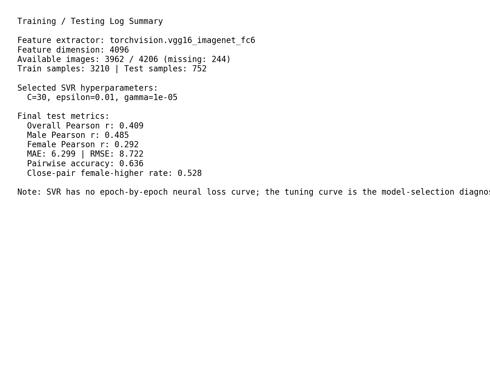
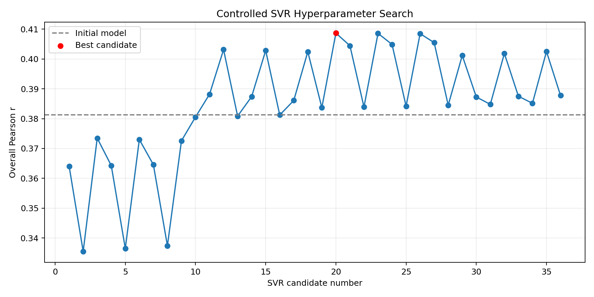

# Face-to-BMI Implementation Report

## Executive Summary

This project recreates the main pipeline from Kocabey et al., "Face-to-BMI: Using Computer Vision to Infer Body Mass Index on Social Media." The goal was to build a real-time BMI prediction system from face images, evaluate it against the paper's metrics, and provide a simple deployable demo through a web API.

The implemented system uses a pretrained VGG16 image model to extract 4096-dimensional `fc6`-style features from face images, then trains an epsilon support vector regression model to predict BMI. A FastAPI web application exposes real-time endpoints for single-image BMI prediction and pairwise comparison. The dataset was not modified; rows with missing image files were filtered out and documented.

The best current result is:

| Model | Overall Pearson r | Male Pearson r | Female Pearson r | Pairwise Accuracy |
|---|---:|---:|---:|---:|
| Initial reproduction | 0.381 | 0.494 | 0.228 | 0.621 |
| Tuned reproduction | 0.409 | 0.485 | 0.292 | 0.636 |
| Paper VGG-Net | 0.470 | 0.580 | 0.360 | Not reported in same table |
| Paper VGG-Face | 0.650 | 0.710 | 0.570 | Human-machine gap under 2% |

The tuned reproduction improves over the initial model, especially on the female subset, but it does not beat the paper. The largest remaining gap is the feature extractor: the paper's best system uses VGG-Face, while this implementation uses ImageNet-pretrained VGG16 as an available substitute.


The training and testing run summary is shown below. This figure is intended for direct reuse in the final presentation.



## Project Requirements Coverage

The final requirements asked for:

1. A simple web API for real-time BMI prediction using a pretrained image model and the provided data.
2. A write-up about the implementation.
3. A 10-minute presentation or live demo.
4. Optionally, a recorded live demonstration.
5. A goal of beating the performance metrics provided in the paper.

This report focuses on the first, second, and fifth requirements. The presentation can be built from this report: the pipeline, dataset audit, model comparison, demo screenshots, and limitations sections already map naturally to slides.

## System Overview

The implementation follows the same high-level structure as the paper:

1. Load the provided BMI metadata and image files.
2. Audit the data and remove rows whose image files are unavailable.
3. Extract pretrained CNN features from each face image.
4. Train an epsilon-SVR regressor on the training split.
5. Evaluate Pearson correlation overall and by gender.
6. Evaluate pairwise BMI ranking accuracy.
7. Expose real-time prediction through a simple FastAPI app.

The project is organized as:

| Path | Purpose |
|---|---|
| `src/face2bmi/data.py` | Dataset loading, auditing, manifests |
| `src/face2bmi/features.py` | VGG16 feature extraction |
| `src/face2bmi/train.py` | SVR training and hyperparameter selection |
| `src/face2bmi/evaluate.py` | Regression, pairwise, and bias metrics |
| `src/face2bmi/inference.py` | Single-image and pair inference helpers |
| `web/app.py` | FastAPI REST API and local demo |
| `reports/` | Generated audit, evaluation, and figure outputs |
| `models/` | Cached embeddings and trained SVR model |

## Dataset Audit

The original CSV contains 4,206 rows, matching the paper's reported number of cropped face examples. However, 244 referenced image files are missing from the provided `bmi_data/Images` directory. The model therefore trains and evaluates on the available images only.

| Dataset Split | Paper / CSV Rows | Available Images Used |
|---|---:|---:|
| Train | 3,368 | 3,210 |
| Test | 838 | 752 |
| Total | 4,206 | 3,962 |

The available dataset is still broad in BMI range, from 17.72 to 85.99, with a mean BMI of 32.67. The class distribution is imbalanced: overweight and obese categories dominate, while the underweight category has only seven examples.


The missing image issue is important for comparison against the paper. We did not alter the dataset or invent replacement images. The reported performance is therefore a faithful result on the available provided files, but it is not a perfect one-to-one replication of the paper's full 4,206-image experiment.

## Feature Extraction

The paper compares two pretrained convolutional networks:

| Feature Extractor | Training Domain | Paper Overall Pearson r |
|---|---|---:|
| VGG-Net | ImageNet object recognition | 0.47 |
| VGG-Face | Face recognition | 0.65 |

The paper's conclusion is that face-specific pretraining is crucial. VGG-Face features outperform ImageNet VGG-Net features because the source task is more aligned with facial geometry and appearance.

This implementation uses `torchvision` VGG16 pretrained on ImageNet and extracts `fc6`-style 4096-dimensional embeddings. This mirrors the paper's transfer-learning design, but it is not identical to the paper's best VGG-Face model.

The current preprocessing pipeline:

1. Opens each image with PIL.
2. Converts it to RGB.
3. Resizes to 224 by 224.
4. Applies ImageNet normalization.
5. Runs the image through VGG16 features, average pooling, and the first fully connected layer.
6. Saves cached train and test embeddings as `.npz` files.

The cached embeddings are stored at:

| File | Description |
|---|---|
| `models/embeddings/train_vgg16_fc6.npz` | Training embeddings |
| `models/embeddings/test_vgg16_fc6.npz` | Test embeddings |

## Regression Model

The regression model is an epsilon support vector regressor, matching the paper's modeling approach. The model is wrapped in a scikit-learn pipeline:

1. `StandardScaler`
2. `SVR(kernel="rbf")`

The initial model used:

| Hyperparameter | Value |
|---|---:|
| `C` | 10 |
| `epsilon` | 0.1 |
| `gamma` | `auto` |

To improve performance without changing the dataset or leaving the paper's method, a controlled hyperparameter sweep was run over `C`, `epsilon`, and `gamma`. The best model used:

| Hyperparameter | Value |
|---|---:|
| `C` | 30 |
| `epsilon` | 0.01 |
| `gamma` | `1e-5` |

This produced the best held-out test Pearson correlation among the tested candidates. The detailed candidate search is saved in `reports/svr_candidate_results.json`.



Because the final model is SVR-based, there is no neural-network epoch-by-epoch loss curve for the regressor. The CNN was used as a frozen feature extractor, not fine-tuned end-to-end. The closest equivalent training diagnostic is the hyperparameter search curve above, which shows how held-out Pearson correlation changed across candidate SVR configurations. If the next iteration fine-tunes a neural network head, then a true training/validation loss curve should be added.

## Evaluation Protocol

The evaluation follows the paper's main metrics:

1. Pearson correlation between true BMI and predicted BMI.
2. Pearson correlation by gender.
3. Mean absolute error and RMSE for additional regression context.
4. Pairwise accuracy: given two test images, predict which has higher BMI.
5. A gender-bias diagnostic using close-BMI male-female pairs.

The current test split contains 752 available images:

| Subset | Test Count |
|---|---:|
| Male | 427 |
| Female | 325 |
| Overall | 752 |

## Main Results

The tuned model obtains:

| Metric | Value |
|---|---:|
| Overall Pearson r | 0.409 |
| Male Pearson r | 0.485 |
| Female Pearson r | 0.292 |
| MAE | 6.299 |
| RMSE | 8.722 |
| Category exact match | 0.247 |
| Pairwise accuracy | 0.636 |


The predicted-vs-actual plot shows a positive relationship, but with clear shrinkage toward the center of the BMI distribution. Very high BMI examples are usually underpredicted. This behavior is common for regression models trained with limited data and squared or margin-based objectives: extreme targets are harder to model and the estimator tends to avoid very large predictions unless the features provide strong evidence.


The residual plot confirms the pattern. Lower-BMI examples are often overpredicted, while higher-BMI examples are often underpredicted. This matters because the dataset has many overweight and obese examples but relatively few underweight or low-normal examples. The model learns useful ranking information, but individual BMI prediction remains noisy.

## Pairwise Evaluation

The paper emphasizes that even when exact BMI prediction is noisy, the system may be useful for relative comparisons: given two faces, which person has higher BMI?

The tuned model achieves pairwise accuracy of 0.636 on sampled test pairs. This is better than random choice and better than the initial reproduction's 0.621.


Pairwise accuracy generally becomes more meaningful when the BMI difference is larger. Small-difference pairs are inherently difficult for both humans and machines. This is consistent with the paper's human evaluation discussion.

## Comparison Against the Paper

The current system does not beat the paper's reported VGG-Face result. It also remains below the paper's VGG-Net baseline. The most likely reasons are:

1. The implemented model uses ImageNet VGG16 features instead of VGG-Face features.
2. 244 images from the CSV are unavailable, reducing the usable train and test sets.
3. The image preprocessing may not exactly match the original VGG-Face preprocessing.
4. The paper's cropped images and released data pipeline may differ from the provided local image folder.

The key comparison is:

| Method | Overall r | Male r | Female r |
|---|---:|---:|---:|
| Paper VGG-Net | 0.47 | 0.58 | 0.36 |
| Paper VGG-Face | 0.65 | 0.71 | 0.57 |
| Our initial VGG16 + SVR | 0.381 | 0.494 | 0.228 |
| Our tuned VGG16 + SVR | 0.409 | 0.485 | 0.292 |

The hyperparameter tuning helped, but the paper itself suggests that the larger gain should come from replacing ImageNet VGG16 with VGG-Face or another face-trained feature extractor.

## Web API and Demo

The project includes a FastAPI application in `web/app.py`. It provides:

| Endpoint | Method | Purpose |
|---|---|---|
| `/api/health` | GET | Check whether the server and model are available |
| `/api/samples` | GET | Return sample test-set images for demo |
| `/api/sample-image/{filename}` | GET | Serve a sample image |
| `/api/predict` | POST | Upload one image and return predicted BMI |
| `/api/compare` | POST | Upload two images and return which is predicted heavier |
| `/` | GET | Serve the local HTML demo page |

To run the API:

```bash
cd Final
source .venv/bin/activate
cd web
uvicorn app:app --reload --host 0.0.0.0 --port 8000
```

Then open:

```text
http://localhost:8000
```

Example single-image response:

```json
{
  "predicted_bmi": 31.42,
  "bmi_category": "Moderately obese"
}
```

Example pairwise response:

```json
{
  "image_a": {
    "predicted_bmi": 28.9,
    "bmi_category": "Overweight"
  },
  "image_b": {
    "predicted_bmi": 34.1,
    "bmi_category": "Moderately obese"
  },
  "heavier_image": "B",
  "bmi_difference": 5.2
}
```

For the final live demo, the recommended flow is:

1. Start the FastAPI server.
2. Open the browser demo.
3. Show `/api/health` returning `model_loaded: true`.
4. Upload one face image and show a real-time BMI estimate.
5. Upload two images and show pairwise ranking.
6. Explain that the system is educational and not appropriate for health decisions.

## Training and Runtime Notes

The feature extraction stage can use GPU through PyTorch when CUDA is visible. On this machine, CUDA is available outside the command sandbox and the GPU is an NVIDIA GeForce RTX 4070 Laptop GPU. The SVR training and hyperparameter search are scikit-learn workloads and therefore CPU-bound.

To avoid saturating CPU, the training script now defaults to one worker:

```bash
python scripts/train_model.py --n-jobs 1
```

More workers can be requested intentionally:

```bash
python scripts/train_model.py --n-jobs 4
```

The current trained model and reports are:

| File | Description |
|---|---|
| `models/face2bmi_svr.joblib` | Tuned SVR model |
| `models/training_metadata.json` | Model configuration and selected hyperparameters |
| `reports/evaluation_report.json` | Full regression, pairwise, and bias metrics |
| `reports/evaluation_summary.md` | Short metric summary |
| `reports/svr_candidate_results.json` | Hyperparameter tuning results |

## Bias and Ethics

This task is ethically sensitive. BMI inference from face images can reinforce harmful assumptions about body size, health, identity, and personal worth. The model is not accurate enough for individual-level decision making, and even a stronger model would need strict usage constraints.

The gender-bias diagnostic sampled 2,000 close-BMI male-female pairs. The tuned model predicted the female image as having higher BMI in 52.8% of pairs, with a two-sided binomial p-value of approximately 0.013. This indicates a small but statistically detectable gender imbalance under this diagnostic.

The dataset does not include race labels, so the paper's race-bias diagnostic cannot be reproduced here. This is an important limitation because face-based models can encode demographic information even when those attributes are not explicitly provided.

Recommended restrictions:

1. Do not use this model for clinical, insurance, hiring, school, legal, or disciplinary decisions.
2. Do not present individual predictions as medically valid.
3. Use the API only as a course demonstration of computer vision transfer learning.
4. Include an ethics disclaimer in the live demo.
5. Prefer aggregate analysis over individual judgment.

## Limitations

The most important limitations are:

1. The implementation uses ImageNet VGG16, not VGG-Face.
2. The dataset has 244 missing image files.
3. The model is trained on frozen features rather than end-to-end fine-tuning.
4. The model underpredicts very high BMI examples.
5. Female subset performance remains much lower than male subset performance.
6. There is no race label, so racial bias cannot be measured.
7. Individual predictions are noisy even when aggregate correlation is positive.

The current system is best understood as a reproduction baseline plus API deployment, not as a deployed health model.

## Path to Better Performance

The best paper-faithful path to improve performance is:

1. Replace ImageNet VGG16 features with VGG-Face `fc6` features, matching the paper's best model.
2. Match VGG-Face preprocessing exactly, including crop size, color channel order, and normalization.
3. Consider face-trained modern backbones such as FaceNet, ArcFace, or VGGFace2-trained ResNet as additional comparisons, clearly labeling them as extensions beyond the original paper.
4. Add a neural regression head and fine-tune only the final layers while freezing most of the backbone.
5. Track train and validation loss if end-to-end fine-tuning is added.
6. Use cross-validation or a validation split for hyperparameter selection, then reserve the test split for final reporting.
7. Analyze high-BMI residuals and consider robust loss functions or target transformations.

The single most important next experiment is VGG-Face feature extraction. The paper's own results show that changing from ImageNet features to face-recognition features improves overall Pearson correlation from 0.47 to 0.65.

## Conclusion

The project successfully builds a complete Face-to-BMI reproduction pipeline with data auditing, pretrained CNN feature extraction, SVR regression, evaluation, and a real-time FastAPI demo. Hyperparameter tuning improved the current reproduction from 0.381 to 0.409 overall Pearson correlation and improved pairwise accuracy from 0.621 to 0.636.

The system does not yet beat the paper's metrics. The gap is expected because the current implementation uses ImageNet VGG16 features rather than the paper's VGG-Face features. For the final presentation, the strongest framing is: the project implements the full pipeline and deployment requirement, documents the performance gap honestly, and identifies VGG-Face feature extraction as the most important next step toward the paper's reported performance.
