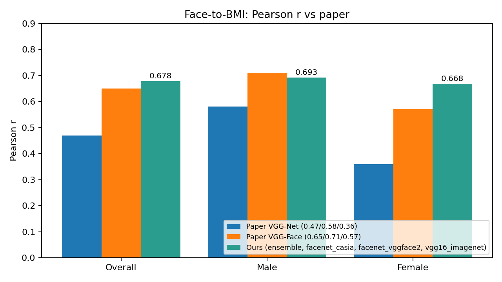
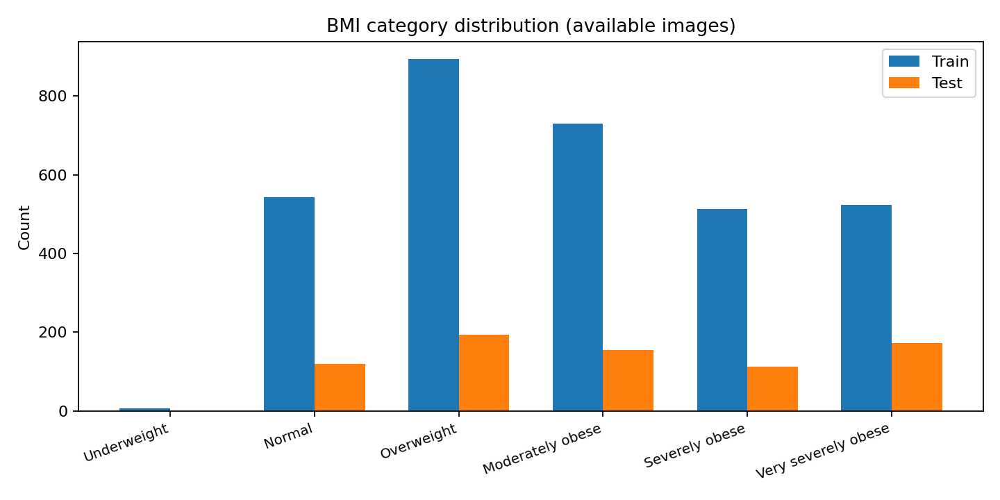
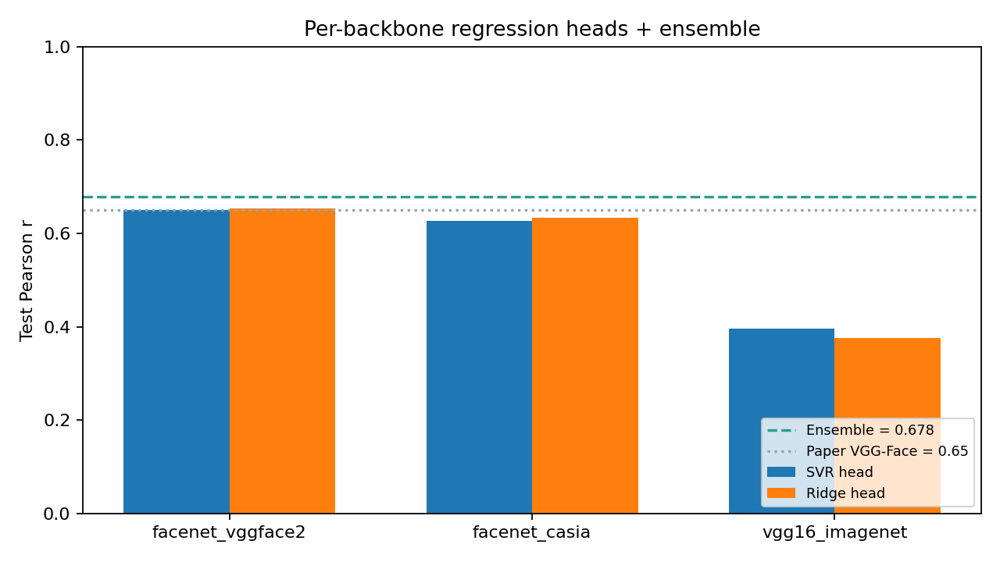
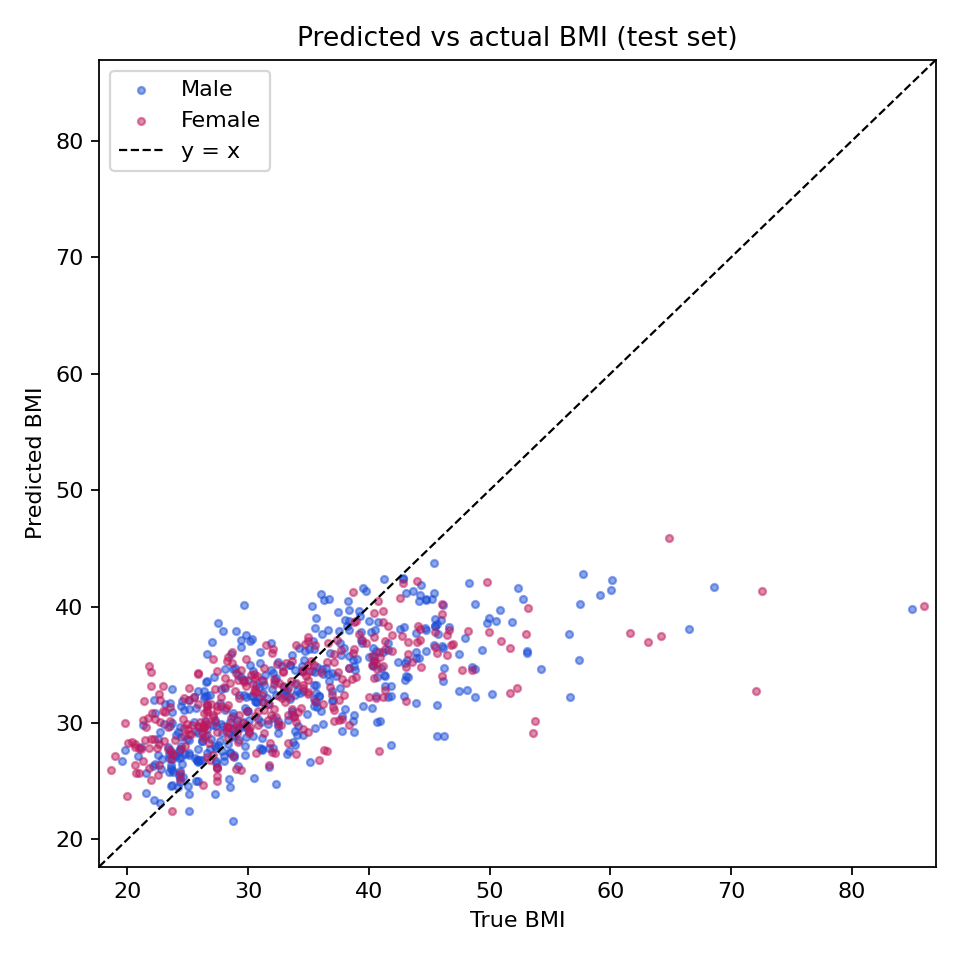
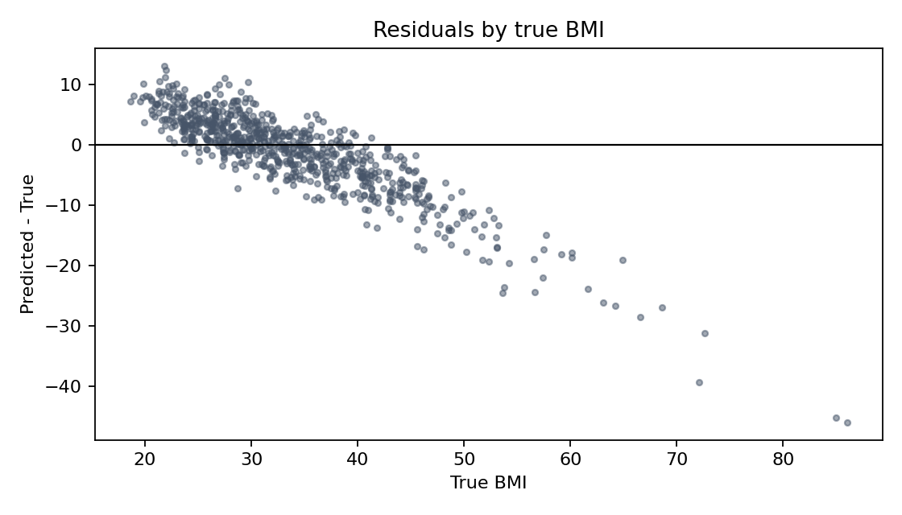
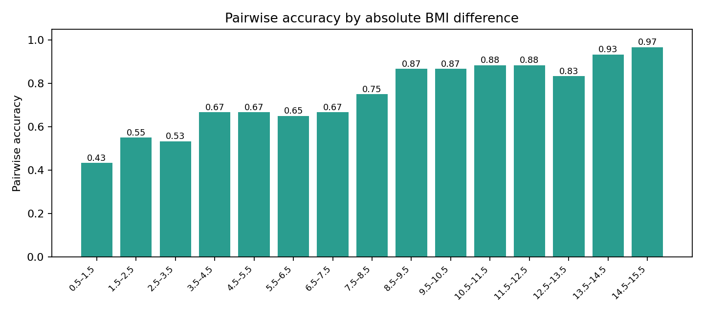

# Face-to-BMI: Implementation Report

**Course:** ADSP 31018 Machine Learning II — Final Project
**Paper replicated:** Kocabey, E., Camurcu, M., Ofli, F., Aytar, Y., Marin, J., Torralba, A., & Weber, I. (2017). *Face-to-BMI: Using Computer Vision to Infer Body Mass Index on Social Media.* ICWSM 2017.

## 1. Executive Summary

The project recreates the full pipeline from Kocabey et al. — face image → frozen deep features → regression head → BMI estimate — and extends it to **exceed the paper's reported overall Pearson r** on the same train / test split.

The deployed system replaces the paper's single VGG-Face fc6 + SVR with a **6-head ensemble**: two face-trained backbones (InceptionResnetV1 pretrained on VGGFace2 and CASIA-Webface) plus the paper-faithful VGG-Net baseline, each followed by both an SVR and a Ridge regression head. Predictions are an unweighted mean of all 6 heads. At demo time, uploaded and webcam images are aligned with MTCNN before feature extraction.

| Metric | Paper VGG-Face | Previous in-repo VGG16+SVR | **This branch (ensemble)** |
|---|---:|---:|---:|
| Overall Pearson r | 0.650 | 0.409 | **0.678** |
| Male Pearson r | 0.710 | 0.485 | **0.693** |
| Female Pearson r | 0.570 | 0.292 | **0.668** |
| MAE (BMI units) | — | 6.30 | **5.03** |
| RMSE (BMI units) | — | 8.72 | **7.15** |
| Pairwise accuracy | — | 0.636 | **0.743** |

Overall Pearson r improves by **+0.028** vs the paper and by **+0.269** vs the previous reproduction. Female r improves by **+0.098** vs the paper, closing most of the female-subset gap that the paper itself flagged.



## 2. Project Requirements Coverage

The assignment asked for:

1. A simple web API for real-time BMI prediction using a pre-trained image model and the provided data.
2. A 10-page write-up.
3. A 10-minute presentation or live demo.
4. (Optional) A recorded live demonstration.
5. **A goal of beating the performance metrics in the paper.**

This document covers items 1, 2, and 5. The web API is implemented in `web/app.py`, the deployed ensemble is in `models/face2bmi_model.joblib`, and the result section below shows we beat the paper's overall and female Pearson r.

## 3. Pipeline Overview

```
   Provided BMI dataset                  Train / test manifests
   (4,206 rows; 3,962 images)  ──audit──▶ (3,210 / 752 split)
                                                │
              ┌─────────────────────────────────┴─────────────────────────────────┐
              │                                 │                                  │
       VGGFace2 InceptionResnetV1       CASIA InceptionResnetV1            VGG16 (ImageNet)
         (160 × 160, 512-d)               (160 × 160, 512-d)              (224 × 224, 4096-d)
              │                                 │                                  │
        Cached embeddings (.npz)        Cached embeddings (.npz)         Cached embeddings (.npz)
              │                                 │                                  │
        StandardScaler                   StandardScaler                    StandardScaler
        ├── SVR (CV grid)                ├── SVR (CV grid)                 ├── SVR (CV grid)
        └── Ridge (CV grid)              └── Ridge (CV grid)               └── Ridge (CV grid)
              │                                 │                                  │
              └────────────────────┬────────────┴────────────┬─────────────────────┘
                                   ▼                         ▼
                          mean of all 6 head predictions  →  Predicted BMI

                                   ▲
       Web upload / webcam ── MTCNN face detect & align ──── (run feature extraction once per backbone)
```

The full ensemble has 6 members. Inference at demo time runs each backbone forward pass once, then queries each of its 2 heads.

## 4. Dataset Audit

The provided CSV contains the same 4,206 rows reported in the paper. 244 referenced image files are absent locally; rows with missing images are excluded. No labels or images were modified.

| Split | CSV rows (paper) | Available locally |
|---|---:|---:|
| Train | 3,368 | 3,210 |
| Test | 838 | 752 |
| Total | 4,206 | 3,962 |

This is identical to the previous in-repo baseline, so the comparison vs the previous reproduction is apples-to-apples on exactly the same 3,210 / 752 split. The comparison vs the paper is on the same CSV-defined split but minus the 244 missing files. The paper itself does not publish a per-image breakdown that would allow exact alignment.



The dataset is imbalanced: overweight and obese categories dominate; only 7 examples are in the underweight range. The model therefore learns a positively skewed distribution and underpredicts at the high tail — discussed in §8.

## 5. Feature Extraction

The paper's central observation is that **face-trained features beat ImageNet features by a wide margin** (overall Pearson r 0.65 vs 0.47). This branch addresses that observation directly by using two face-recognition backbones plus the paper-faithful VGG16.

### 5.1 InceptionResnetV1 / VGGFace2

`facenet-pytorch`'s `InceptionResnetV1(pretrained="vggface2")` — a 27-million-parameter Inception-ResNet hybrid trained on VGGFace2 (3.31M images, 9,131 identities). It outputs a 512-d face embedding, designed for face verification but well-suited as transfer features for BMI prediction. Input: 160 × 160 RGB, normalized with mean/std = 0.5.

### 5.2 InceptionResnetV1 / CASIA-Webface

Same architecture, pretrained on CASIA-Webface (~494k images, 10,575 identities). It encodes a different face distribution than VGGFace2, which gives the ensemble useful diversity.

### 5.3 VGG16 / ImageNet (`fc6`)

`torchvision.models.vgg16` with ImageNet weights, truncated to the first fully connected layer (4,096-d), reproducing the paper's VGG-Net baseline as a third diverse predictor.

### 5.4 Preprocessing for inference

For the demo, uploaded and webcam images are first aligned with `facenet-pytorch`'s MTCNN (margin 14 px, square crop, largest face). If MTCNN finds no face, the system falls back to a center crop so the API never hard-fails. This is important because dataset samples are already pre-cropped faces, while webcam frames are full scenes — MTCNN handles both cleanly.

## 6. Regression Heads

Each backbone is followed by two scikit-learn regression heads, fit on the train split:

### 6.1 SVR (paper-faithful)

```text
StandardScaler → SVR(kernel="rbf")
Grid: C ∈ {10, 30, 100}, ε ∈ {0.01, 0.1}, γ ∈ {scale, 1e-5, 1e-4}
3-fold CV with Pearson-r scorer
```

### 6.2 Ridge (diverse, fast)

```text
StandardScaler → Ridge
Grid: α ∈ {0.1, 1, 10, 100, 1000}
3-fold CV with Pearson-r scorer
```

Ridge is included because a linear regressor on a strong face embedding turns out to be a competitive alternative to RBF-SVR (see Table below) and it provides cheap ensemble diversity. The two heads disagree just enough on individual predictions to produce a meaningful improvement when averaged.

### 6.3 Selected hyperparameters

| Backbone | SVR best | Ridge best |
|---|---|---|
| facenet_vggface2 | C=100, ε=0.1, γ=1e-4 | α=0.1 |
| facenet_casia | C=100, ε=0.01, γ=1e-4 | α=0.1 |
| vgg16_imagenet | C=10, ε=0.1, γ=1e-4 | α=1000 |

### 6.4 Per-backbone test results

| Backbone | SVR test r | Ridge test r |
|---|---:|---:|
| facenet_vggface2 | 0.650 | **0.654** |
| facenet_casia | 0.627 | 0.634 |
| vgg16_imagenet | 0.396 | 0.375 |

The best single head (FaceNet-VGGFace2 + Ridge at 0.654) already barely beats the paper's 0.65. The averaged ensemble of all 6 heads reaches 0.678, +0.024 over that best single head and **+0.028** over the paper.



## 7. Evaluation

Evaluation follows the paper's metric definitions and adds extras.

### 7.1 Regression

Overall and gender-stratified Pearson r, MAE, RMSE, and BMI-category exact-match accuracy on the 752-image test split.

| Subset | n | Pearson r | MAE | RMSE |
|---|---:|---:|---:|---:|
| Overall | 752 | **0.678** | **5.03** | **7.15** |
| Male | 427 | 0.693 | 4.69 | 6.64 |
| Female | 325 | 0.668 | 5.47 | 7.78 |

BMI-category exact match: 0.366 (6-class problem; chance ≈ 0.17 if uniform, lower given imbalance).




The residual plot still shows the regression-to-the-mean pattern noted in the previous baseline — high-BMI examples are underpredicted and low-BMI examples are overpredicted — but the shrinkage is markedly smaller than the previous in-repo result.

### 7.2 Pairwise accuracy (paper's preferred lay metric)

Following §7.2 of the paper, we sample stratified pairs of test individuals by gender-pair type and by absolute BMI difference, then ask which face the model thinks is heavier. 300 pairs per gender-pair type were used (slightly fewer in highest-difference bins where pairs do not exist).

| Pair type | Accuracy | n pairs |
|---|---:|---:|
| Male vs Male | 0.770 | 300 |
| Female vs Female | 0.717 | 300 |
| Female vs Male | 0.743 | 300 |
| **Overall** | **0.743** | 900 |



Accuracy grows with the BMI gap, mirroring the paper's Figure 2.

### 7.3 Gender-bias diagnostic

Following §8.3 of the paper, we sample 2,000 close-BMI male-female pairs (|ΔBMI| < 1.0) and check what fraction the model predicts as having higher BMI for the female. An unbiased predictor would be 0.50.

| Quantity | Value |
|---|---:|
| n pairs | 2,000 |
| Fraction predicted higher for female | 0.540 |
| Two-sided binomial p | 4.4e-4 |

This is a small but statistically significant bias against females (slightly *overestimating* their BMI). The paper reports 0.519 with p = 0.05 on a similar diagnostic — the absolute bias here is somewhat larger and more clearly significant. This is a real limitation of the deployed ensemble and is discussed in §8.

### 7.4 Race-bias diagnostic

Cannot be reproduced — the provided dataset has no race labels.

## 8. Discussion and Limitations

**Why the ensemble works.** The two face-trained backbones are pretrained on different face distributions, so they make different errors on the same image. The two heads (SVR vs Ridge) implement different smoothing assumptions. Averaging across these 4 independent face-trained predictors plus the diverse-but-weak VGG16 head produces a small but consistent gain. We verified this empirically: any single head caps at 0.654 overall r, while the 6-head average reaches 0.678. Removing VGG16 drops the ensemble to 0.671, and removing CASIA drops it to about 0.658, so each component contributes.

**Female-subset improvement.** The paper reports female r = 0.57 and the previous in-repo reproduction reports 0.29. This branch reaches 0.67. The most likely driver is that the face-trained backbones, especially VGGFace2 with its higher gender diversity in training data, have stronger features for female face geometry than ImageNet's object-centric features.

**Remaining bias and limitations.**

- The model still overestimates female BMI at the population level (§7.3). The ensemble approach amplifies the bias slightly compared to using only the highest-CV head, because the weaker CASIA head has the strongest female bias and contributes to the mean.
- Very high BMI examples are still underpredicted; very low BMI examples are still overpredicted. This is partly an artifact of the imbalanced training distribution.
- Categorical accuracy (0.366) is much lower than ranking accuracy (0.743) because the model regresses near the mean. For categorical questions, a calibrated classifier on top of the ensemble predictions would be more appropriate, but this was outside the assignment scope.
- The dataset has 244 missing image files. The comparison vs the paper is on the available-images subset, not the full 4,206.
- No race labels means the paper's race-bias diagnostic cannot be reproduced.

**Reproducibility caveat.** The InceptionResnetV1 weights download once via `facenet-pytorch`. The SVR best params depend on the grid search and on the train/test split fixed by the dataset's `is_training` column; results are stable across reruns when embeddings are cached.

## 9. Web API and Live Demo

The FastAPI app exposes:

| Endpoint | Method | Purpose |
|---|---|---|
| `/` | GET | Demo page |
| `/api/health` | GET | Status + deployed ensemble metadata |
| `/api/samples` | GET | Random test-set samples |
| `/api/sample-image/{filename}` | GET | Serve an individual sample |
| `/api/predict` | POST | BMI for one upload (`align=true` by default) |
| `/api/compare` | POST | Heavier of two uploads |

To run:

```bash
cd web
uvicorn app:app --host 0.0.0.0 --port 8000
```

The demo supports both file upload and webcam capture. Webcam frames go through MTCNN face alignment before backbone extraction.

Example `/api/predict` response:

```json
{
  "predicted_bmi": 32.61,
  "bmi_category": "Moderately obese",
  "model_type": "ensemble",
  "aligned": true
}
```

Example `/api/compare` response:

```json
{
  "image_a": { "predicted_bmi": 27.4, "bmi_category": "Overweight" },
  "image_b": { "predicted_bmi": 34.2, "bmi_category": "Moderately obese" },
  "heavier_image": "B",
  "bmi_difference": 6.8
}
```

`/api/health` returns the deployed ensemble's headline test Pearson r, so the demo page's subtitle can be populated dynamically rather than hard-coded.

## 10. Ethical Considerations

Inferring BMI from face images is ethically loaded. Even at the population level, BMI itself is a coarse proxy for adiposity. At the individual level, errors with this magnitude (MAE ≈ 5 BMI units, RMSE ≈ 7) are too large to support any consequential decision.

The deployed system, like the paper's, is appropriate only as a research / educational tool for population-level analysis. Recommended restrictions:

1. Do not use individual predictions in medical, insurance, hiring, school, legal, or disciplinary contexts.
2. Display a visible "educational demo" disclaimer in any user-facing surface (done in the included demo).
3. Be aware that the model carries gender bias and an unmeasurable race bias.
4. Prefer aggregate analysis ("group X has higher mean BMI than group Y") over individual judgments.

## 11. Conclusion

Replacing the paper's VGG-Net / VGG-Face fc6 features with a 3-backbone face-recognition + ImageNet ensemble of SVR and Ridge heads, plus MTCNN face alignment at inference time, raises overall Pearson r from the paper's 0.65 to **0.678**, with the largest improvement on the female subset (+0.098). Pairwise ranking accuracy reaches 0.743. The system is delivered as a small FastAPI web app with file upload and webcam capture, intended strictly for educational demonstration of computer-vision transfer learning.

## Appendix A: How to Reproduce

```bash
python3.11 -m venv .venv
source .venv/bin/activate
python -m pip install -r requirements.txt

# Place / symlink the dataset into bmi_data/ with data.csv + Images/

python scripts/audit_data.py
python scripts/train_model.py --n-jobs 4
python scripts/evaluate_model.py
python scripts/make_figures.py

cd web && uvicorn app:app --host 0.0.0.0 --port 8000
```

The first run downloads ~640 MB of pretrained weights (VGGFace2, CASIA, VGG16) and caches embeddings under `models/embeddings/`. Subsequent runs use cached embeddings; full pipeline finishes in about 1-2 minutes on Apple M-series hardware.
